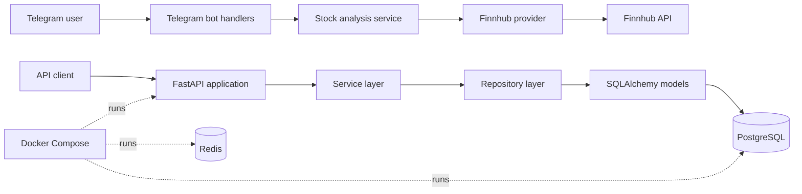

# AlphaMind AI

AlphaMind AI is a Python service for looking up company information and stock prices through a FastAPI API and a Telegram bot. The current implementation focuses on the Sprint 1 foundation: application structure, persistence, Finnhub integration, REST endpoints, and a basic conversational stock lookup flow.

## Current Status

**Sprint 1 — Foundation: complete**

Implemented today:

- FastAPI application with a health-style root endpoint
- Company create and read operations
- Stock price creation, lookup, history, and latest-price operations
- SQLAlchemy models, repositories, and services
- PostgreSQL persistence with Alembic migrations
- Finnhub company search, company profile, and quote requests
- Telegram `/start` and `/help` commands
- Telegram stock lookup by company name or ticker, with current quote details
- Docker Compose services for the application, PostgreSQL, and Redis

The project does **not** yet provide AI-generated analysis, news integration, a market-data pipeline, or portfolio intelligence.

## Architecture

Redis is provisioned by Docker Compose, but an application data flow using Redis is not implemented yet.

## Implemented API Surface

| Area | Routes | Purpose |
| --- | --- | --- |
| Companies | `POST /companies` | Create a company record |
| Companies | `GET /companies` | List companies |
| Companies | `GET /companies/{company_id}` | Retrieve one company |
| Stock prices | `POST /stock-prices` | Add a stock price record |
| Stock prices | `GET /stock-prices/{stock_price_id}` | Retrieve one stock price |
| Stock prices | `GET /stock-prices/company/{company_id}` | Retrieve a company’s price history |
| Stock prices | `GET /stock-prices/company/{company_id}/latest` | Retrieve the latest company price |
| Application | `GET /` | Confirm that the API is running |

## Telegram Bot

The bot currently supports:

- `/start` — displays a welcome message and example stock queries
- `/help` — displays usage guidance
- Plain-text company names or tickers — searches Finnhub and returns the current quote when available

## Tech Stack

The following technologies are present in the repository:

- **Python 3.14**
- **FastAPI** and **Uvicorn** for the HTTP API
- **SQLAlchemy** with **psycopg** for database access
- **PostgreSQL 17** for persistence
- **Alembic** for database migrations
- **Redis 8** as a provisioned infrastructure service
- **python-telegram-bot** for Telegram integration
- **httpx** for asynchronous Finnhub HTTP requests
- **Pydantic Settings** and `python-dotenv` for configuration
- **Docker** and **Docker Compose** for local services
- **Finnhub API** as the current market-data provider

## Roadmap

The following items are planned and are not implemented yet:

- [ ] Market data pipeline
- [ ] News integration
- [ ] AI-generated stock analysis
- [ ] Portfolio intelligence
